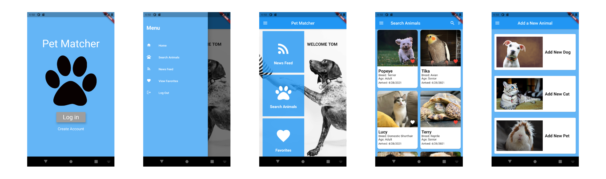

# pet-matcher

A cross-platform mobile app (**iOS & Android**) to match animal-loving people with animals in need of homes.

## Description

**Pet Matcher** is a **cross-platform** mobile application designed to connect animal lovers with adoptable pets. The app serves two main user groups:

- **Adoption center staff** looking to place animals in homes.
- **Potential adopters** searching for pets to adopt.
 

## Documentation

This project was developed as a capstone project for an undergraduate computer science course at Oregon State University. Please refer to the following resources:

- 📄 [**Detailed documentation**](docs/reports/Team_Intercontinental_Final_Report.pdf)  
- 🎥 [**Video demo**](https://media.oregonstate.edu/media/t/1_mgeoe4tz)  
- 🛠️ [**Development setup guide**](docs/reports/Team_Intercontinental_Project_Demo.pdf)  
- 📌 [**Technical poster**](docs/reports/Team_Intercontinental_Poster.pdf)  

## Questions / Contributions

If you have any questions or would like to contribute, feel free to:  

- Open an **issue** in the repository.  
- Submit a **pull request** with improvements or fixes.  

We appreciate your feedback and contributions! 🚀

